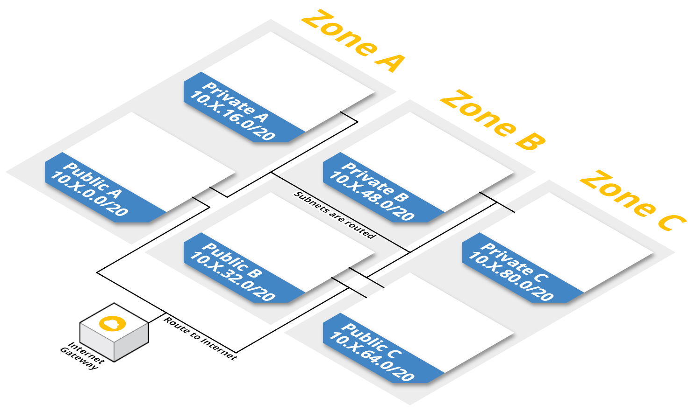
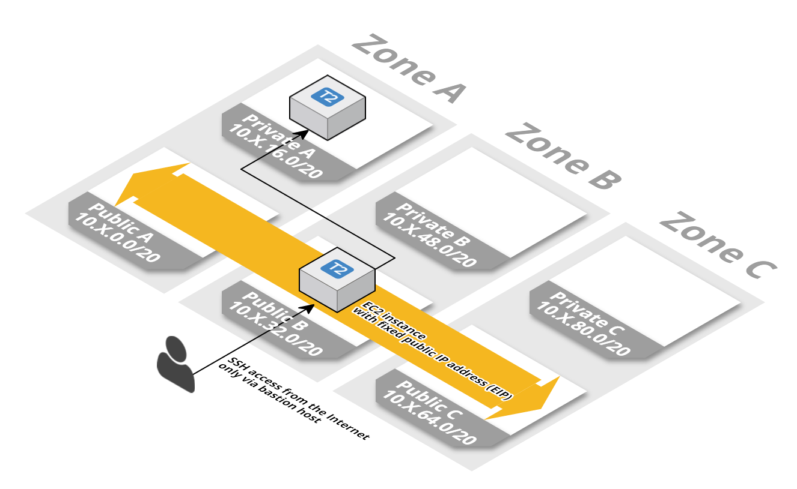
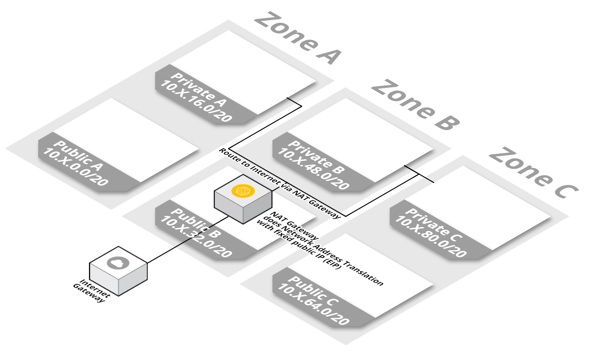

# Automated provisioning for Amazon Web Services

Create a self-healing, auto-scaling Docker in Swarm Mode cluster in AWS using Terraform.

## Architecture

The cluster consists of 2 autoscaling groups: one for 3 managers, one for 3 workers,
spread across 3 availability zones.

The managers group has exactly 3 machines. The workers group is auto-scaling and
you can configure the minimums and maximums.

In both groups the instance template used is configured to automatically join
into a Docker Swarm using a small bit of bookkeeping stored in an EFS
NFS shared filesystem.

The scripts also configure network security to allow the Swarm to communicate and
allow incoming SSH connections to the managers.

Have a look at the [terraform dependency graph](./doc/graph.pdf).

### Left for the user

These scripts don't automatically set up a load balancer.

## Prerequisites

You will need:

* Terraform on your machine

* The Coreos `ct` provider for Terraform. This converts Container Linux Config into `ignition` configuration for bootstrapping the EC2 instances. To install:
  ```sh
  go get -u github.com/coreos/terraform-provider-ct
  ```

  ([More details](https://github.com/coreos/terraform-provider-ct))

* An AWS account with a VPC network containing at least one
  subnetwork (we recommend having two networks - one public, one private)

* Your AWS credentials file (`~/.aws/credentials`) should contain a profile called `microplatform` with associated access key id and secret access key.

* VPC with public and private subnets in 3 AZs (https://s3-eu-west-1.amazonaws.com/widdix-aws-cf-templates-releases-eu-west-1/stable/vpc/vpc-3azs.yaml)


[](https://console.aws.amazon.com/cloudformation/home#/stacks/new?stackName=vpc-3azs&templateURL=https://s3-eu-west-1.amazonaws.com/widdix-aws-cf-templates-releases-eu-west-1/stable/vpc/vpc-3azs.yaml)

[Guide](http://templates.cloudonaut.io/en/stable/vpc/#vpc-with-private-and-public-subnets-in-three-availability-zones)

* You may also want an ssh bastion host in a public subnet.
(https://s3-eu-west-1.amazonaws.com/widdix-aws-cf-templates-releases-eu-west-1/stable/vpc/vpc-ssh-bastion.yaml)


[](https://console.aws.amazon.com/cloudformation/home#/stacks/new?stackName=vpc-ssh-bastion&templateURL=https://s3-eu-west-1.amazonaws.com/widdix-aws-cf-templates-releases-eu-west-1/stable/vpc/vpc-ssh-bastion.yaml)

[Guide](http://templates.cloudonaut.io/en/stable/vpc/#ssh-bastion-hostinstance)

[Notes](https://github.com/widdix/aws-ec2-ssh)

* You may also want NAT gateways (one in each AZ).
(https://s3-eu-west-1.amazonaws.com/widdix-aws-cf-templates-releases-eu-west-1/stable/vpc/vpc-nat-gateway.yaml)


[](https://console.aws.amazon.com/cloudformation/home#/stacks/new?stackName=vpc-nat-gateway&templateURL=https://s3-eu-west-1.amazonaws.com/widdix-aws-cf-templates-releases-eu-west-1/stable/vpc/vpc-nat-gateway.yaml)

[Guide](http://templates.cloudonaut.io/en/stable/vpc/#nat-gateway)

## Usage

1. Update `variables.tf` to match your project
1. Run `terraform plan` to see what will be created
1. Run `terraform apply`. Once terraform is done, it'll take a few minutes for all
   the compute instances to start and join the swarm.
1. You should now be able to ssh onto one of the managers, run `docker node ls`
   and you should see the cluster nodes.

## To do

* Limit SSH access to only non-interactive only to only allow tunnelling to the
  manager nodes to issue docker commands
* Create an SSH bastion that is the only machine accessible from the public
  internet and the only machine allowed to connect to the swarm managers
* Add conditional load balancer creation
